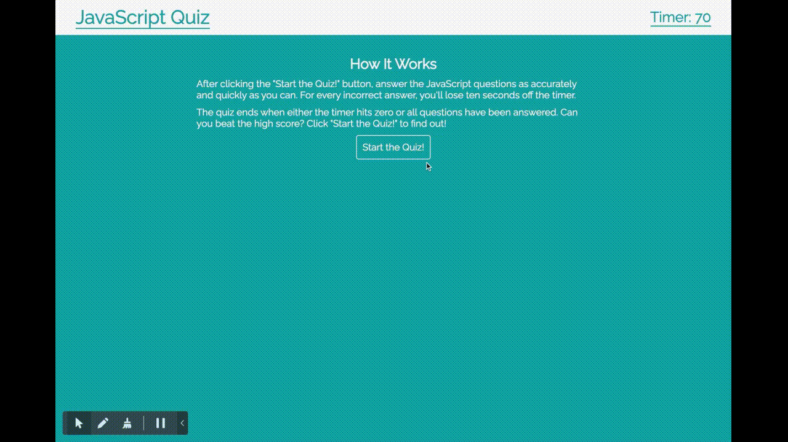

# JavaScript Quiz
A timed quiz on JavaScript fundamentals that stores high scores.

## Description
This JavaScript quiz uses Web APIs and DOM manipulation to dynamically change the page contents while testing a user's knowledge of JavaScript fundamentals.

## Languages, Frameworks, and Libraries Used
- HTML
- CSS
- JavaScript
- jQuery

## Deployed Application
[You can find the deployed application at this address.](https://rrcampbell-exe.github.io/coding-quiz/)

## Screenshot

